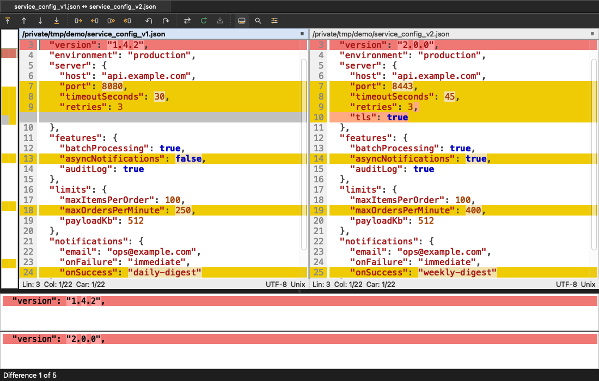
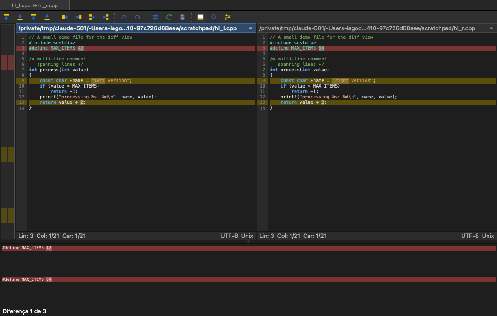
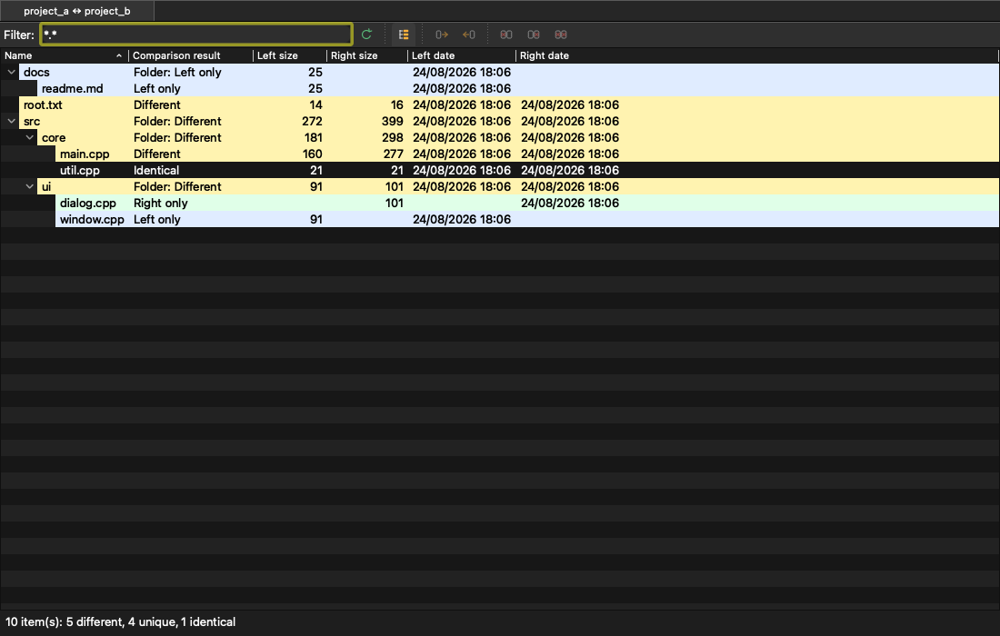
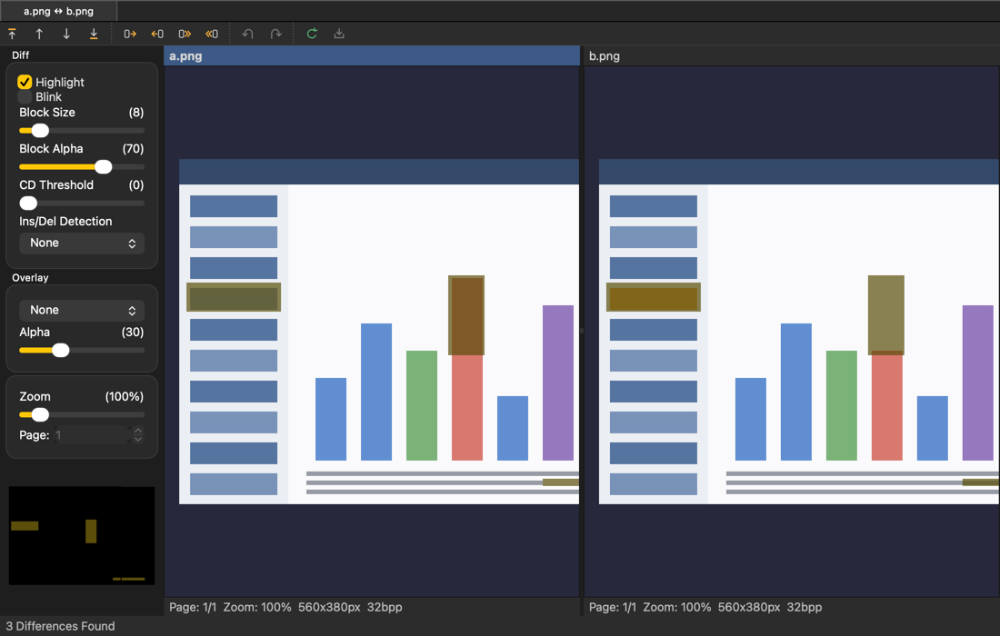
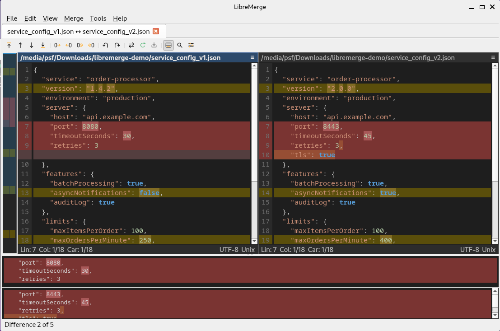

# LibreMerge

**A free, open-source differencing and merging tool for macOS (and Linux) — bringing the WinMerge experience beyond Windows.**

LibreMerge reuses the battle-tested comparison engine of [WinMerge](https://winmerge.org/) — GNU diffutils + git xdiff, folder scanning, file filters, moved-block detection, Unicode handling — and rebuilds the user interface natively with Qt 6, since the original UI is written in MFC and cannot leave Windows. If you know WinMerge, you already know LibreMerge: the layout, the colors and the workflow are intentionally the same.

📦 [Releases](https://github.com/iagodpassos/libremerge/releases) · ☕ [Buy me a coffee](https://buymeacoffee.com/iagodpassos)



## Features

- **Side-by-side file comparison and merging** (2-way and 3-way) with the classic WinMerge look: gold difference blocks, word-level highlights inside lines, gray filler keeping the panes aligned line by line
- **Free editing with live remerge**: type directly in the panes, copy differences (or all of them) in either direction, undo/redo, recompare with F5; files are saved with their original encoding, BOM and line endings preserved
- **Folder comparison** with a hierarchical tree or flat list, background scanning with progress and cancel, file masks / regex / expression filters, copy between sides and delete to Trash
- **Diff pane** showing the current difference per file, **location pane** minimap, per-pane headers and status bars (line/column, encoding, EOL)
- **CSV/TSV table comparison** as side-by-side grids: cell-level difference highlighting, delimiter auto-detection (`,` `;` tab `|`), quoted fields, first-row headers
- **Image comparison** (2-way and 3-way) with WinMerge's own image-diff engine: block-level pixel differences with adjustable block size and color-distance threshold, insertion/deletion detection for shifted rows/columns, XOR and alpha-blend overlays, blink mode, wipe and rectangle-select dragging, multi-page navigation (animated GIF, multi-page TIFF), rotation/flips, copy between sides with undo, and a clickable difference minimap
- **Line filters** (regular expressions that mark matching differences as trivial) and **moved block detection**
- **Find and replace** in the compare panes (⌘F, wrap-around, match case)
- **Syntax highlighting** for 47 languages, via WinMerge's own parsers
- **Light and dark themes** (or follow the system), **English and Brazilian Portuguese** interface following the system language
- Drag & drop files or folders onto the window or the Dock icon; a WinMerge-style "Select Files or Folders" screen with history, read-only flags and swap
- Comparison options carried over from WinMerge: ignore whitespace/case/blank lines/EOL/numbers, diff algorithm selection (Myers, minimal, patience, histogram)

| Dark theme | Folder comparison |
| --- | --- |
|  |  |

| Image comparison | On Linux (Debian/GNOME) |
| --- | --- |
|  |  |

## Install (macOS)

**Requirements**: macOS 12 or later, Intel or Apple Silicon (universal binary).

**Homebrew**:

```sh
brew install --cask iagodpassos/tap/libremerge
```

(Recent Homebrew asks you to trust third-party taps first: `brew trust iagodpassos/tap`.)

**Manual**: download `LibreMerge-<version>.dmg` from the [releases page](https://github.com/iagodpassos/libremerge/releases), open it and drag LibreMerge to Applications.

LibreMerge is not yet notarized by Apple, so the first launch needs one extra step: right-click the app → **Open** (or allow it under **System Settings → Privacy & Security**). If macOS still refuses ("app is damaged"), clear the download quarantine once:

```sh
xattr -d com.apple.quarantine /Applications/LibreMerge.app
```

You can also launch comparisons from the terminal:

```sh
LibreMerge left.txt right.txt          # 2-way file compare
LibreMerge base.txt mine.txt theirs.txt  # 3-way
LibreMerge dirA/ dirB/                 # folder compare
```

## Build from source (macOS / Linux)

Dependencies: a C++17 compiler, CMake ≥ 3.21, Ninja, Qt 6, POCO, ICU and Boost (headers). On macOS: `brew install cmake ninja qt poco icu4c boost googletest`. On Debian/Ubuntu see the package list in [`.github/workflows`](.github/workflows).

```sh
cmake -S . -B build -G Ninja
cmake --build build
ctest --test-dir build        # engine test suite (369 tests)
./build/app/LibreMerge        # (on macOS: build/app/LibreMerge.app)
```

## Install (Linux)

**AppImage** (recommended — any distro, x86_64 or arm64): download the `LibreMerge-<version>-<arch>.AppImage` for your architecture from the [releases page](https://github.com/iagodpassos/libremerge/releases), make it executable and run — Qt, ICU and Poco are bundled, nothing to install. Needs glibc 2.36+ (Debian 12+, Ubuntu 24.04+, Mint 22+, Fedora 37+, Arch):

```sh
chmod +x LibreMerge-<version>-x86_64.AppImage && ./LibreMerge-<version>-x86_64.AppImage
```

**Debian 13** (amd64): a native `.deb` for apt integration — dependencies resolve from the official repositories:

```sh
sudo apt install ./libremerge_<version>_amd64_debian13.deb
```

**Arch Linux**: an AUR package is on the way. Meanwhile, `packaging/aur/PKGBUILD` in this repository builds and installs cleanly with `makepkg -si`.

Other formats (Ubuntu-specific builds, Flatpak) are planned — open an issue if you need one and it moves up the list.

## Use with git

LibreMerge works as git's merge and diff tool. Conflicts open in the familiar three-pane layout, with the merged result in the middle pane.

**macOS**:

```sh
git config --global merge.tool libremerge
git config --global mergetool.libremerge.cmd \
  '/Applications/LibreMerge.app/Contents/MacOS/LibreMerge "$LOCAL" "$MERGED" "$REMOTE"'

git config --global diff.tool libremerge
git config --global difftool.libremerge.cmd \
  '/Applications/LibreMerge.app/Contents/MacOS/LibreMerge "$LOCAL" "$REMOTE"'
```

**Linux**: the same commands, with `libremerge` (or the path to the AppImage) in place of the full bundle path.

To use it, run `git mergetool` after a conflict: resolve it in the middle pane, save, and close the window. Two notes on the extra files you may see afterwards:

- LibreMerge writes a `.bak` copy next to the file it saves, which is WinMerge's default behavior. Turn it off under Options > General if you prefer.
- `git mergetool` itself keeps a `.orig` file unless you set `git config --global mergetool.keepBackup false`.

## Known limitations

- Binary files are detected and refused — binary/hex comparison is planned, not implemented
- 3-way comparison is available for files and images, not folders yet
- Archive (zip/7z) comparison from WinMerge is not ported yet
- Image comparison: animated GIF and multi-page TIFF open and compare, but cannot be saved back (no Qt encoder — Save As offers PNG); SVG/PDF comparison is not supported yet
- Table comparison copies whole differences (no per-cell editing or undo yet)

## Support

If LibreMerge saves you time, you can [buy me a coffee](https://buymeacoffee.com/iagodpassos). ☕

## AI-assisted development

This port was built with the assistance of **Claude Fable 5**, an AI model by [Anthropic](https://www.anthropic.com): the engine portability layer, the Qt interface and the release tooling came out of AI-assisted pair-programming sessions. Everything that ships is validated against WinMerge's own engine test suite (369 tests) and an application selftest suite, on macOS and Linux CI.

## Relationship to WinMerge, license

LibreMerge is an independent port based on the comparison engine of [WinMerge](https://winmerge.org/), © Dean P. Grimm / Thingamahoochie Software and the WinMerge contributors, licensed GPL-2.0-or-later. Vendored engine sources keep their original headers; the port layer and the Qt application are new code. See [docs/VENDORED.md](docs/VENDORED.md) for the exact provenance and local-change policy.

LibreMerge as a whole is distributed under the **GNU GPL v3.0 or later** ([LICENSE](LICENSE)).

**LibreMerge is not affiliated with or endorsed by the WinMerge project.** The name and icon are original to this project.

## Roadmap

Binary/hex compare, archive support, 3-way folders, HTML reports, notarized builds, Linux packages (AUR first), and — if it proves itself — offering the portable engine fixes back to WinMerge upstream ([WinMerge/winmerge#141](https://github.com/WinMerge/winmerge/issues/141) tracks the idea of a cross-platform UI).

Issues and pull requests are welcome.
